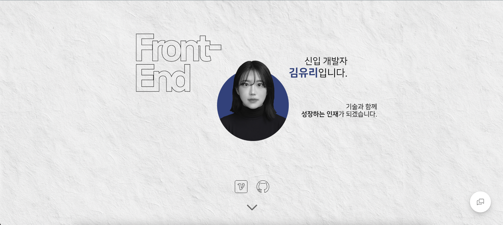
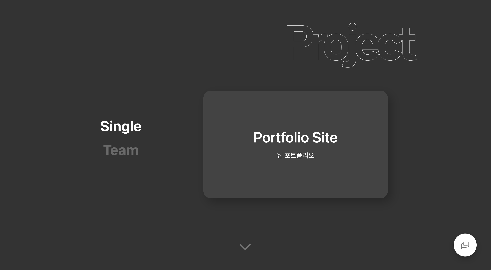

# Portfolio Site

> 프로젝트 경험과 문제 해결 과정을 일관된 구조로 전달하기 위해 제작한 반응형 프론트엔드 포트폴리오 웹사이트입니다.

<br />

<p align="center">
  
</p>

<br />

## 🔗 배포 및 관련 링크

- **배포 사이트:** [포트폴리오 바로가기](https://uowllnh.github.io/portfolio)
- **GitHub:** [저장소 바로가기](https://github.com/uowllnh/portfolio)

<br />

## 📌 프로젝트 소개

기존 포트폴리오는 완성된 결과물만 나열하기 쉬워 프로젝트에서 어떤 문제를 발견했고, 어떻게 해결했는지 충분히 전달하기 어려웠습니다.

이 프로젝트는 **프론트엔드 개발자의 경험과 역량을 확인하려는 방문자**를 위해 제작했습니다. 프로젝트별 문제 정의, 개선 과정, 기술적 구현, 트러블슈팅을 같은 흐름으로 읽을 수 있도록 상세 페이지 구조를 통일하고, 다양한 화면에서도 콘텐츠의 우선순위가 유지되도록 반응형 UI를 설계했습니다.

<br />

## 📅 개발 기간

- 2025.03 ~ 진행 중

<br />

## 👥 개발 인원 및 역할

### 개인 프로젝트

- 포트폴리오 전체 UX/UI 설계
- React 기반 프론트엔드 개발
- TypeScript 기반 컴포넌트 구조 설계
- 반응형 웹 및 스크롤 인터랙션 구현
- Firebase 연동 및 GitHub Pages 배포

<br />

## 🛠 기술 스택

### Front-End

<p>
  
  
  
  
</p>

### Data / Interaction

<p>
  
  
  
</p>

### Tools / Deployment

<p>
  
  
  
</p>

<br />

## ✨ 주요 기능

### 1. 프로젝트 탐색 및 상세 정보

<p align="center">
  
</p>

- 프로젝트를 유형별로 탐색하고 상세 내용을 확인할 수 있습니다.
- 문제 정의, 개선 전후, 구현 내용, 트러블슈팅, 회고 순으로 정보를 제공합니다.
- 프로젝트 데이터를 공통 상세 컴포넌트에 전달해 동일한 정보 구조를 유지합니다.

### 2. 반응형 포트폴리오 UI

- 모바일과 데스크톱에서 콘텐츠 우선순위가 유지되도록 레이아웃을 조정했습니다.
- 화면 크기에 따라 이미지와 텍스트 배치가 자연스럽게 변경됩니다.
- 스크롤 기반 인터랙션과 Lottie 애니메이션으로 섹션 전환에 시각적 피드백을 제공합니다.

### 3. 프로젝트 데이터 연동

- 로컬 프로젝트 데이터를 기본값으로 제공해 원격 데이터 조회 실패 시에도 콘텐츠를 표시합니다.
- TanStack Query로 Firebase 프로젝트 데이터를 조회하고 로딩·오류 상태를 분리했습니다.
- 프로젝트 저장 후 관련 쿼리를 무효화해 최신 데이터가 반영되도록 구성했습니다.

<br />

## 🖥 화면 구성

| 화면 | 설명 |
| --- | --- |
| 인트로 | 개발자 소개와 포트폴리오의 분위기를 전달합니다. |
| 소개 | 기술 스택과 개발자로서의 강점을 보여줍니다. |
| 프로젝트 목록 | 프로젝트를 유형별로 탐색할 수 있습니다. |
| 프로젝트 상세 | 문제 정의, 구현 내용, 트러블슈팅과 회고를 제공합니다. |
| 연락처 | GitHub 등 외부 채널로 이동할 수 있습니다. |

<br />

## 📁 폴더 구조

```text
src
├── api
│   └── seedProject.ts
├── assets
│   ├── image
│   └── logos
├── components
│   ├── details
│   ├── ProjectDetail.tsx
│   └── ProjectSection.tsx
├── firebase
├── hooks
├── types
├── App.tsx
└── main.tsx
```

공통 UI, 프로젝트별 데이터, 외부 데이터 연동 코드를 역할에 따라 분리해 프로젝트 추가와 수정이 쉽도록 구성했습니다.

<br />

## 🔍 주요 구현 내용

### 재사용 가능한 프로젝트 상세 구조

프로젝트마다 반복되는 개요, 기술 스택, 개선 내용, 트러블슈팅, 스크린샷 영역을 `ProjectDetail` 컴포넌트로 통합했습니다. 각 프로젝트 파일은 `ProjectProps` 타입에 맞는 데이터만 제공하므로 상세 페이지의 표현 방식과 정보 구조를 일관되게 유지할 수 있습니다.

### 서버 상태와 폴백 데이터 관리

- Firebase 데이터: TanStack Query로 조회 및 캐시
- 저장 작업: `useMutation`으로 처리
- 원격 조회 실패: 로컬 프로젝트 데이터를 폴백으로 사용
- 저장 완료: `projects` 쿼리 무효화 후 최신 데이터 재조회

### 반응형 UI와 인터랙션

Tailwind CSS와 CSS 미디어 쿼리를 활용해 화면 크기별 레이아웃을 조정했습니다. Intersection Observer 기반 커스텀 훅, GSAP, Lottie를 조합해 스크롤 위치에 따른 섹션 노출과 애니메이션을 구현했습니다.

<br />

## 🚨 문제 해결 경험

### 문제 1. 프로젝트 상세 페이지의 반복 구조

**문제**

프로젝트가 추가될 때마다 유사한 상세 페이지 마크업이 반복되어 코드 중복과 정보 구조 불일치가 발생할 수 있었습니다.

**원인**

화면 구조와 프로젝트 데이터가 개별 페이지에 함께 작성되어 있었습니다.

**해결**

공통 `ProjectDetail` 컴포넌트와 `ProjectProps` 타입을 만들고 프로젝트별 데이터만 props로 전달하도록 구조를 변경했습니다.

**결과**

새 프로젝트를 데이터 파일 하나로 추가할 수 있게 되었고, 전체 상세 페이지의 구성과 스타일을 한 곳에서 관리할 수 있게 됐습니다.

---

### 문제 2. 원격 데이터 조회 실패 시 콘텐츠 유실

**문제**

Firebase 연결이나 권한 문제로 프로젝트 조회가 실패하면 포트폴리오의 핵심 콘텐츠가 표시되지 않을 수 있었습니다.

**원인**

화면이 원격 데이터 응답에만 의존할 경우 네트워크 상태가 곧 콘텐츠 가용성에 영향을 줍니다.

**해결**

로컬 프로젝트 데이터를 기본값으로 유지하고, Firebase 조회에 성공했을 때 원격 데이터와 병합하도록 구성했습니다.

**결과**

외부 서비스 상태와 관계없이 프로젝트 정보를 표시하면서도 원격 데이터 업데이트를 반영할 수 있게 됐습니다.

<br />

## 💡 프로젝트를 통해 배운 점

- 포트폴리오는 결과물뿐 아니라 문제 해결 과정과 구현 의도를 함께 보여줘야 한다는 점을 배웠습니다.
- 데이터와 화면 구조를 분리하면 프로젝트가 늘어나도 일관성과 유지보수성을 지킬 수 있음을 경험했습니다.
- 원격 데이터에 폴백을 두어 사용자에게 핵심 콘텐츠가 안정적으로 전달되도록 설계했습니다.
- 반응형 UI에서는 장식보다 콘텐츠 우선순위를 먼저 결정해야 한다는 점을 확인했습니다.

<br />

## 🔧 개선 예정 사항

- [ ] 프로젝트별 성능 지표 및 Lighthouse 결과 추가
- [ ] 키보드 탐색과 스크린 리더 접근성 개선
- [ ] 컴포넌트 및 데이터 병합 로직 테스트 작성
- [ ] 프로젝트 이미지 최적화와 지연 로딩 적용
- [ ] 프로젝트별 배포·저장소 링크 보강

<br />

## 🚀 실행 방법

```bash
git clone https://github.com/uowllnh/portfolio.git
cd portfolio
npm install
npm run dev
```

### 환경변수

프로젝트 루트에 `.env` 파일을 생성합니다.

```env
VITE_FIREBASE_API_KEY=YOUR_API_KEY
VITE_FIREBASE_AUTH_DOMAIN=YOUR_AUTH_DOMAIN
VITE_FIREBASE_PROJECT_ID=YOUR_PROJECT_ID
VITE_FIREBASE_STORAGE_BUCKET=YOUR_STORAGE_BUCKET
VITE_FIREBASE_MESSAGING_SENDER_ID=YOUR_MESSAGING_SENDER_ID
VITE_FIREBASE_APP_ID=YOUR_APP_ID
```

> 실제 API 키나 비밀 정보는 GitHub에 업로드하지 않습니다.
